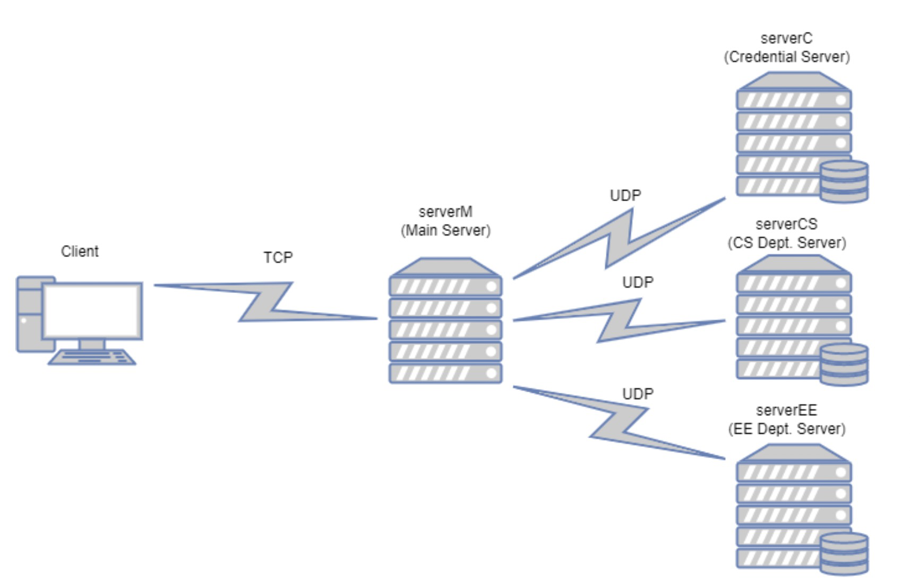

## Socket Programming Project

This repo contains the implementations of a simple **web registration system** for USC. Specifically, a student will use the client to access the central web registration server, which will forward their requests to the department servers in each department. For each department, the department server will store the information of the courses offered in this department. Additionally, a credential server will be used to verify the identity of the student.

There are total 5 communication end-points:

- Client: used by a student to access the registration system.
- Main server (serverM): coordinate with the backend servers.
- Credential server (serverC): verify the identity of the student.
- Department server(s) (serverCS and serverEE)): store the information of courses offered by this department.



For the backend servers, Credential server and Department servers will access corresponding files on disk, and respond to the request from the main server based on the file content. It is important to note that only the corresponding server should access the file. It is prohibited to access a file in the main server or other servers. We will use both TCP and UDP connections. However, we assume that all the UDP packages will be received without any error.

## Getting Started 

1. Navigate to the project floder in your terminal and run commend:

   ```c
   make all
   ```

2. Start the processes in this order: **ServerM, ServerC, ServerEE, ServerCS, and client.**

## Files and folder structure

1.Source Code Files: 

​     ServerM (Main Server),Backend-Servers C, CS and EE,Client

2.Input Files:

- **cred.txt**: contains encrypted usernames and passwords. Only be accessed by the Credential server.
- **ee.txt,cs.txt**: contains course information categorized in course code, credit, professor, days and course name.
- **cred_unencrypted.txt** :the unencrypted version of *cred.txt*

## The format of all the message exchanged

1.client -> serverM -> serverC:：

​	 "%s,%s", username, password

2.serverC -> serverM -> client:

​	buf[0] == '2' means Authentication is successful 
​    buf[0] == '1' means Authentication failed:Password does not match
​    buf[0] == '0' means Authentication failed:Username Does not exist

3.client -> serverM -> serverCS/EE:

​	For cs dept query:"0:%s:%s:%s:", course code, category,username, 
​	For ee dept query:”1:%s:%s:%s:”, course code, category,username, 

4.serverCS/EE -> serverM -> client:

​    "<information>"

## Reused code

I use blocks of code from Beej’s socket programming tutorial (Beej’s guide to network programming) in my project.

## Learn More

1.How to unzip tar.gz file in linux

```
tar -xf input_files.tar.gz
```

2.To learn more about this project, see the [project description](./extra/EE450_Project_Fall_2022.pdf) for more details.